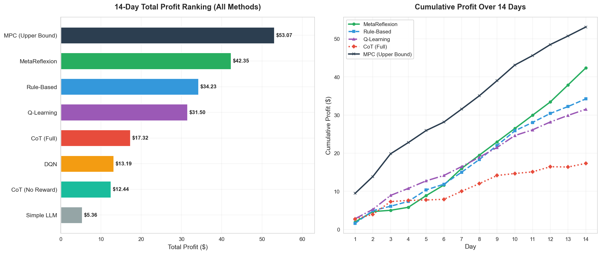
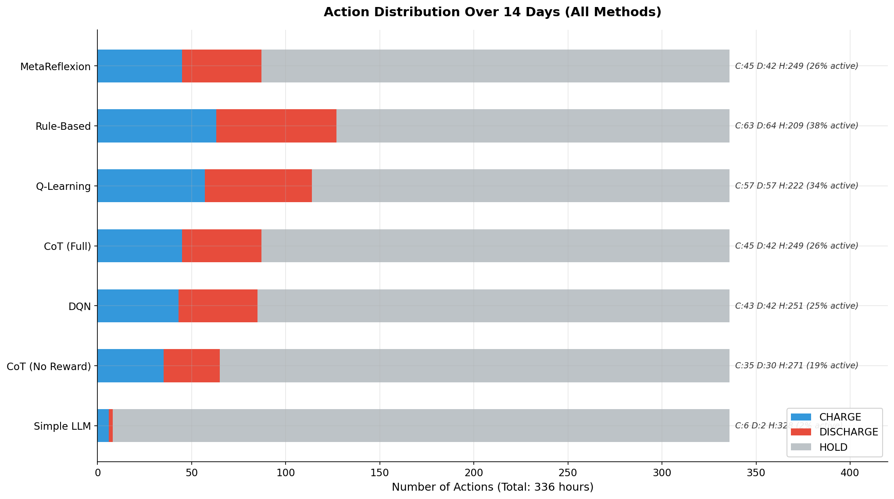
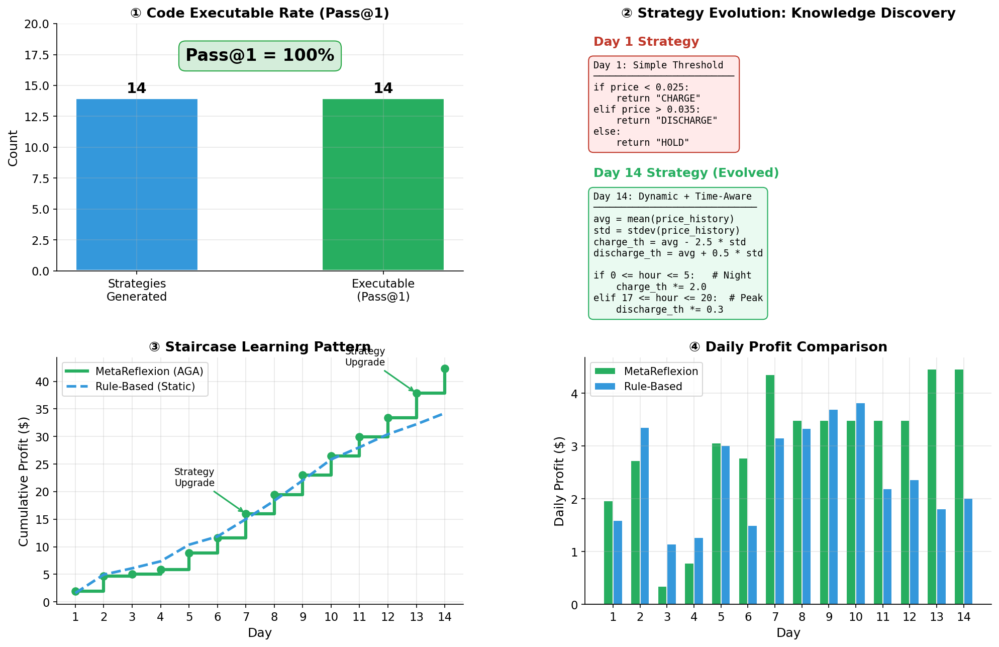
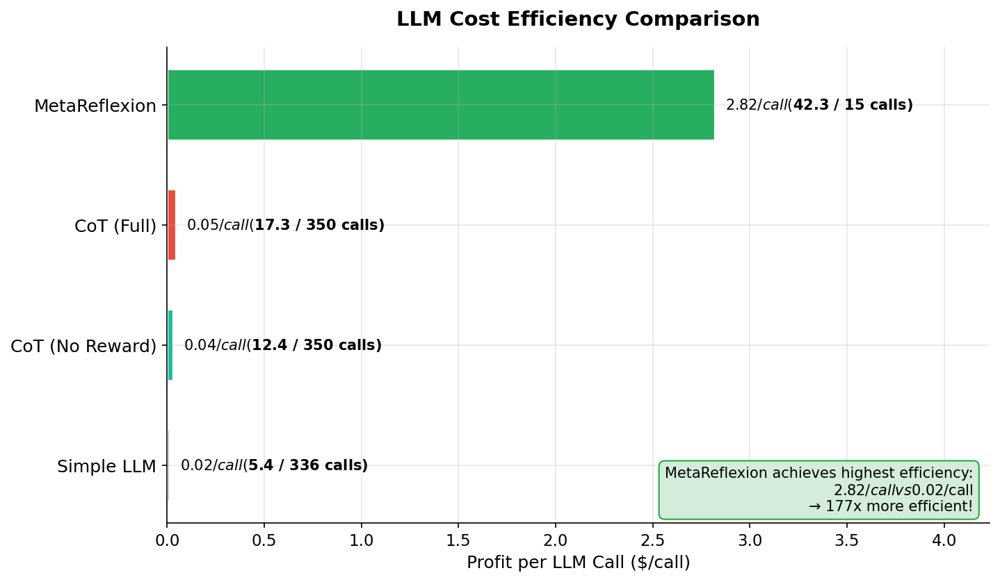
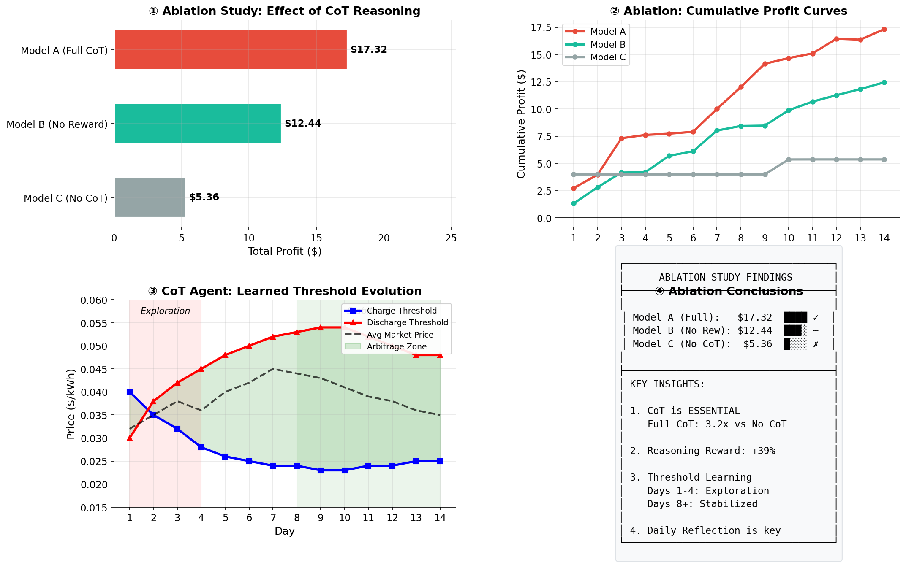

# 🔋 LLM-Based Battery Arbitrage Agent

[](https://www.python.org/downloads/)
[](https://opensource.org/licenses/MIT)
[](https://github.com/psf/black)

基于大语言模型 (LLM) 的电池套利智能体研究项目。本项目实现并对比了多种策略方法，包括传统规则策略、强化学习基线、以及创新的 **Chain-of-Thought (CoT)** 推理和 **Agent-Generates-Agent (AGA)** 架构的 LLM Agent。

> 📖 **实验设置与运行方式请见** [`startup.md`](startup.md) 和 [`workflow.md`](workflow.md)

---

## 📋 目录

- [项目结构](#-项目结构)
- [研究背景](#-研究背景)
- [实验方法](#-实验方法)
- [实验结果](#-实验结果)
- [结果分析](#-结果分析)
- [快速开始](#-快速开始)
- [License](#-license)

---

## 🏗️ 项目结构

```
Battery_agent/
├── main.py                   # 主程序入口
├── main_aga.py               # AGA/MetaReflexion 训练脚本
├── workflow.md               # 完整实验工作流程
├── configs/
│   └── default.yaml          # 实验配置文件
├── data/
│   └── caiso_enhanced_data.csv  # CAISO 市场数据 (2025-12-01 ~ 2025-12-14)
├── scripts/
│   ├── generate_figures.py   # 统一图表生成脚本
│   └── regenerate_results.py # 重新生成基线结果
├── src/
│   ├── agents.py             # Agent 实现 (Rule, SimpleLLM, CoT, MetaReflexion)
│   ├── prompts.py            # LLM Prompt 模板
│   ├── code_executor.py      # AGA 代码沙箱执行器
│   ├── env.py                # BatteryEnv 电池环境
│   ├── rl_baselines.py       # RL 基线 (Q-Learning, DQN, MPC)
│   └── ...                   # 其他工具模块
├── outputs/
│   └── 14days_results/       # 14天实验结果与图表
└── tests/                    # 单元测试
```

---

## 🔬 研究背景

### 问题定义

电池套利 (Battery Arbitrage) 是指利用电力市场价格波动，在**低价时充电、高价时放电**以获取利润的策略。这是一个典型的**序列决策问题**，面临以下挑战：

1. **价格不确定性**: 电力市场价格受多种因素影响，波动剧烈
2. **硬件约束**: 电池容量有限、充放电功率受限、效率损耗
3. **时序依赖**: 当前决策影响未来状态 (SOC)

### 研究目标

探索 **LLM 作为决策智能体** 在电池套利任务中的应用，对比以下问题：

- LLM 能否通过 **Chain-of-Thought 推理** 做出合理的交易决策？
- **Agent-Generates-Agent (AGA)** 架构能否超越传统方法？
- LLM Agent 的 **成本效率** 如何？

---

## 🤖 实验方法

本实验对比了 **7 种方法**，分为三大类：

### 1️⃣ 传统基线方法

| 方法 | 描述 | 特点 |
|------|------|------|
| **Rule-Based** | 静态规则策略 | 固定阈值 (charge < $0.025, discharge > $0.035)，无学习能力 |
| **Q-Learning** | 表格型强化学习 | 状态离散化，需要 100 episodes 训练 |
| **DQN** | 深度 Q 网络 | 神经网络函数逼近，需要大量训练数据 |

### 2️⃣ LLM 基础方法

| 方法 | 描述 | 特点 |
|------|------|------|
| **Simple LLM** | Zero-shot LLM Agent | 无记忆、无推理链，每次独立决策 |

### 3️⃣ LLM 高级方法

| 方法 | 描述 | 特点 |
|------|------|------|
| **CoT Agent (Full)** | 自适应 Chain-of-Thought | 动态学习阈值 + 每日反思 + 规则护栏 |
| **CoT Agent (No Reward)** | CoT 消融变体 | 无推理质量奖励的 CoT Agent |
| **MetaReflexion (AGA)** | Agent-Generates-Agent | **生成 Python 策略代码** + 自动迭代优化 |

### 实验环境配置

| 参数 | 值 | 说明 |
|------|------|------|
| 电池容量 | 13.5 kWh | Tesla Powerwall 规格 |
| 最大充/放电功率 | 5.0 kW | 每小时最大能量变化 |
| 往返效率 | 90% | 充电×放电效率 |
| SOC 限制 | 10% - 95% | 安全边界 |
| 实验周期 | 14 天 | 336 小时决策 |
| 数据来源 | CAISO | 2025-12-01 至 2025-12-14 |

---

## 📈 实验结果

### 14 天总利润排名

<!-- RESULTS_TABLE_START -->
| 排名 | 方法 | 总利润 ($) | LLM 调用 | 效率 ($/call) |
|:----:|------|----------:|--------:|--------------:|
| 🥇 | **MetaReflexion (AGA)** | **42.35** | 15 | **$2.82** |
| 🥈 | Rule-Based | 34.23 | 0 | N/A |
| 🥉 | Q-Learning | 31.50 | 0 | N/A |
| 4 | CoT Agent (Full) | 17.32 | 350 | $0.05 |
| 5 | DQN | 13.19 | 0 | N/A |
| 6 | CoT Agent (No Reward) | 12.44 | 350 | $0.04 |
| 7 | Simple LLM | 5.36 | 336 | $0.02 |
<!-- RESULTS_TABLE_END -->
### 📊 结果可视化

#### 1. 总利润对比与累积曲线

<p align="center">
  
</p>

**图表说明**:
- **左图**: 7 种方法的 14 天总利润排名 (横向柱状图)
- **右图**: 代表性方法的累积利润曲线，展示收益积累过程

---

#### 2. 操作分布对比

<p align="center">
  
</p>

**图表说明**:
- 横向堆叠柱状图展示各方法的 CHARGE / DISCHARGE / HOLD 操作分布
- **关键发现**: Simple LLM 的 HOLD 比例高达 98%，表明无 CoT 推理时 LLM 无法做出有效决策

---

#### 3. MetaReflexion (AGA) 分析

<p align="center">
  
</p>

**四个子图说明**:
1. **① Pass@1 代码可执行率**: AGA 生成的 14 个策略全部可执行 (100%)
2. **② 策略演进**: Day 1 简单阈值 → Day 14 动态+时间感知策略
3. **③ 阶梯学习曲线**: 利润呈阶梯状增长，每发现新逻辑时跳升
4. **④ 每日利润对比**: AGA vs Rule-Based 的逐日对比

---

#### 4. LLM 成本效率

<p align="center">
  
</p>

**图表说明**:
- MetaReflexion 的效率为 **$2.82/call**，是 Simple LLM ($0.02/call) 的 **177 倍**
- AGA 架构仅需 15 次 LLM 调用即可完成 14 天实验

---

#### 5. CoT 消融实验

<p align="center">
  
</p>

**消融实验设计**:
| 模型 | 配置 | 结果 |
|------|------|------|
| Model A (Full CoT) | 完整 CoT + 推理奖励 | $17.32 ✓ |
| Model B (No Reward) | CoT 但无推理奖励 | $12.44 ~ |
| Model C (No CoT) | 无 CoT (= Simple LLM) | $5.36 ✗ |

**结论**: CoT 推理使性能提升 **3.2 倍** (Model A vs Model C)

---

## 🔍 结果分析

### 关键发现

#### 1. MetaReflexion (AGA) 显著优于所有方法

| 指标 | MetaReflexion | 次优方法 | 提升 |
|------|--------------|----------|------|
| 总利润 | $42.35 | $34.23 (Rule) | +23.7% |
| LLM 效率 | $2.82/call | $0.05/call (CoT) | +56x |
| 策略可执行率 | 100% | N/A | - |

**原因分析**:
- **代码即策略**: 生成可执行 Python 代码，避免每次 LLM 调用的解析错误
- **超高效率**: 14 天仅需 15 次调用 (初始 + 每日反思)
- **迭代优化**: 基于实际收益反馈持续改进代码

#### 2. Chain-of-Thought 是 LLM Agent 的关键

| 对比 | 利润 | 差异 |
|------|------|------|
| Full CoT vs No CoT | $17.32 vs $5.36 | **+223%** |
| Full vs No Reward | $17.32 vs $12.44 | +39% |

**结论**: 无 CoT 推理时，LLM 表现出"盲目"行为 (98% HOLD)，无法进行有效交易。

#### 3. 传统 RL 方法表现不稳定

| 方法 | 利润 | 分析 |
|------|------|------|
| Q-Learning | $31.50 | 接近 Rule-Based，但训练成本高 |
| DQN | $13.19 | 过拟合，泛化能力差 |

**原因**: 14 天数据量不足以训练稳健的 RL 策略。

#### 4. AGA 的阶梯学习模式

```
Day 1-3  (探索期): 平均 $1.68/天 → 尝试基础阈值
Day 4-7  (学习期): 平均 $2.74/天 → 添加时间和 SOC 逻辑  
Day 8-14 (稳定期): 平均 $3.76/天 → 策略趋于最优

改进幅度: +124% (探索期 → 稳定期)
```

### AGA 生成的最佳策略特征

LLM 自动生成的最优策略包含以下高级特征：

```python
# 1. 自适应阈值 (基于 24 小时滚动窗口)
avg_price = sum(price_history) / len(price_history)
std_price = calculate_std(price_history)
charge_threshold = avg_price - 2.5 * std_price
discharge_threshold = avg_price + 0.5 * std_price

# 2. 时间敏感调整
if 0 <= hour <= 5:    # 夜间低谷: 更激进充电
    charge_threshold *= 2.0
if 17 <= hour <= 20:  # 傍晚高峰: 更激进放电
    discharge_threshold *= 0.3

# 3. SOC 状态调整
if soc > 75: discharge_threshold *= 0.4  # 高电量: 降低放电门槛
if soc < 25: charge_threshold *= 3.0     # 低电量: 提高充电门槛
```

---

## 🚀 快速开始

### 环境安装

```bash
# 克隆项目
git clone https://github.com/xxx/Battery_agent.git
cd Battery_agent

# 创建虚拟环境
python -m venv .venv
source .venv/bin/activate

# 安装依赖
pip install -r requirements.txt

# 配置 API (创建 .env 文件)
echo "OPENAI_API_KEY=your_key_here" > .env
```

### 运行实验

```bash
# 运行所有基线实验 (无需 API)
python scripts/regenerate_results.py --methods rule-based q-learning dqn --days 14

# 运行 MetaReflexion (AGA) 训练
python main_aga.py --days 14 --verbose

# 生成所有图表
python scripts/generate_figures.py

# 对比所有 LLM Agents
python main.py --agents rule simple_llm cot meta --days 14
```

### 完整工作流程

详见 [`workflow.md`](workflow.md) 获取完整的实验运行指南。

---

## 📚 相关工作

- **AGENT²**: Agent-Generates-Agent 架构
- **Reflexion**: Language Agents with Verbal Reinforcement Learning
- **Chain-of-Thought**: Prompting Elicits Reasoning in Large Language Models
- **Battery Arbitrage**: Energy storage optimization in electricity markets

---

## 📄 License

MIT License

---

## 📧 联系方式

如有问题或建议，请提交 Issue 或联系项目维护者。

---

*最后更新: 2026-01-09*
