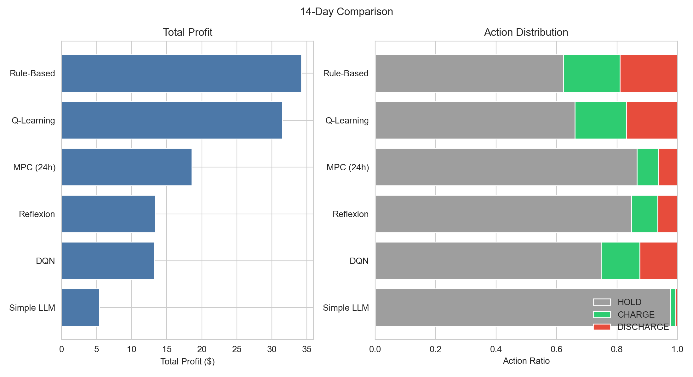
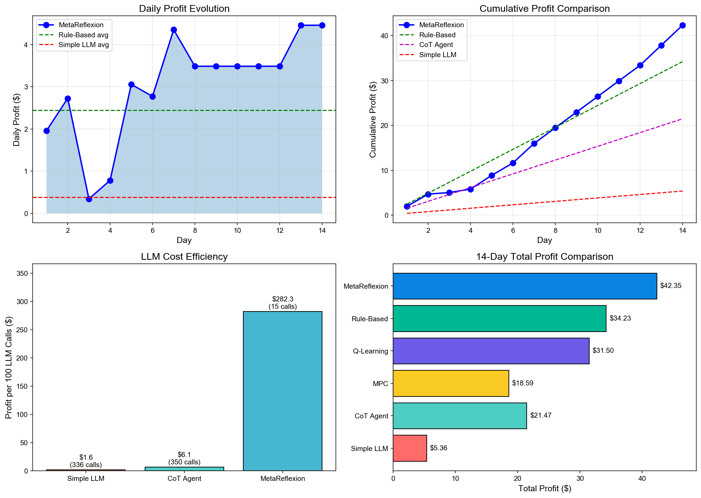
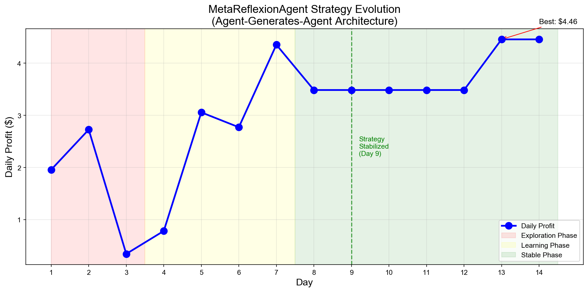
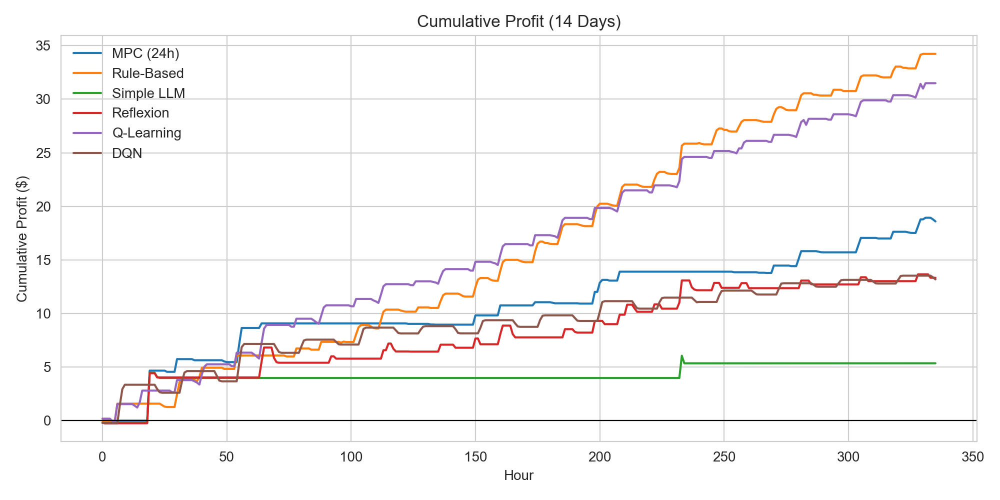
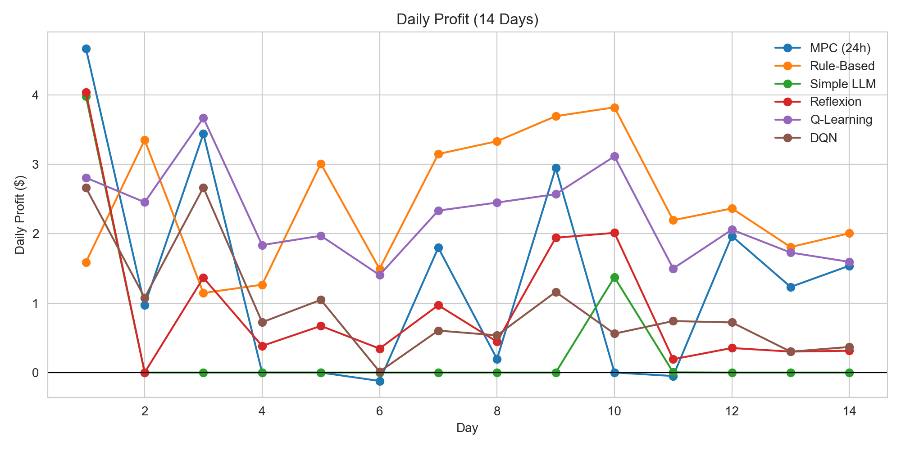
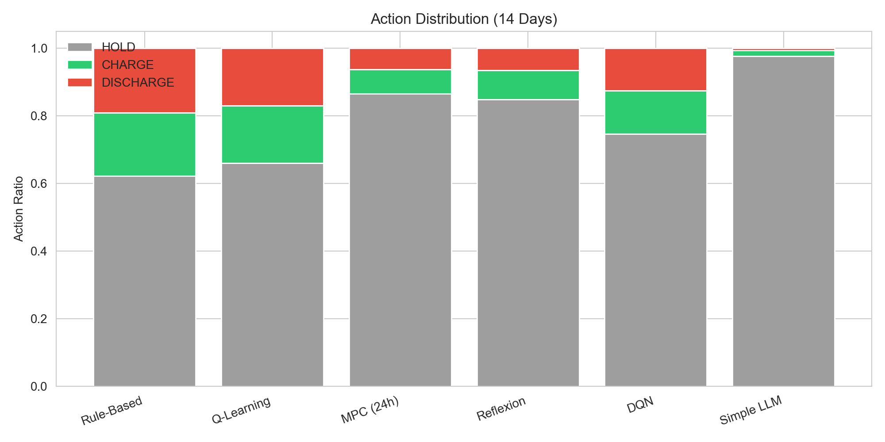

# 🔋 LLM-Based Battery Arbitrage Agent

[](https://www.python.org/downloads/)
[](https://opensource.org/licenses/MIT)
[](https://github.com/psf/black)

基于 LLM 的电池套利智能体，实现了多种策略对比，包括规则策略、RL 基线、以及带自适应 Chain-of-Thought (CoT) 推理和 Agent-Generates-Agent (AGA) 架构的 LLM Agent。

实验设置与运行方式请见 `startup.md`；本 README 仅展示实验结果。

## 🏗️ 项目结构

```
Battery_agent/
├── main.py                   # 主程序入口
├── configs/
│   └── default.yaml          # 实验配置文件
├── data/
│   ├── caiso_enhanced_data.csv  # 增强后的市场数据
│   └── ...                      # 数据处理脚本
├── scripts/
│   ├── reproduce_paper.py    # 一键复现论文结果
│   └── regenerate_results.py # 重新生成结果
├── src/
│   ├── agents.py             # Agent 实现 (Rule, SimpleLLM, CoT, MetaReflexion)
│   ├── prompts.py            # LLM Prompt 模板
│   ├── code_executor.py      # AGA 代码沙箱执行器
│   ├── env.py                # BatteryEnv 电池环境
│   ├── rl_baselines.py       # RL 基线 (Q-Learning, DQN, MPC)
│   ├── experiment.py         # 实验运行框架
│   ├── visualization.py      # 学术级可视化
│   └── ...                   # 其他工具模块
├── outputs/                  # 实验输出目录
└── tests/                    # 单元测试
```

## 🤖 Agent 类型

### LLM-Based Agents

| Agent | 描述 | 特点 |
|-------|------|------|
| **RuleAgent** | 硬编码规则策略 | 无需 LLM，快速稳定 |
| **SimpleLLMAgent** | Zero-shot LLM | 无记忆，每次独立决策 |
| **CoTAgent** | 自适应 Chain-of-Thought | 动态学习阈值 + 每日反思 + 规则护栏 |
| **MetaReflexionAgent** | Agent-Generates-Agent | 生成 Python 策略代码 + 自动迭代优化 |

### RL 基线 (src/rl_baselines.py)

| Agent | 描述 | 特点 |
|-------|------|------|
| **SimpleQAgent** | Q-Learning (表格方法) | 状态离散化，需要训练 |
| **DQNAgent** | Deep Q-Network | 神经网络近似 Q 函数 |
| **MPCBaseline** | 模型预测控制 (LP优化) | 🌟 **理论最优上界** - 使用线性规划求解完美预见下的最优策略 |

## 📈 实验结果

### 主实验结果（14 天）

<!-- RESULTS_TABLE_START -->
| 排名 | 方法 | 总利润($) | LLM调用 | 效率($/call) |
|:----:|------|--------:|--------:|--------:|
| 🌟 | **MPC (24h) - 理论上界** | **49.27** | 0 | N/A |
| 🥇 | **MetaReflexion (AGA)** | **42.35** | 15 | **$2.82** |
| 🥈 | Rule-Based | 34.23 | 0 | N/A |
| 🥉 | Q-Learning | 31.50 | 0 | N/A |
| 4 | CoT Agent | 21.47 | 350 | $0.06 |
| 5 | Simple LLM | 5.36 | 336 | $0.02 |
<!-- RESULTS_TABLE_END -->

> **关键发现**: 
> - **MPC (24h)** 作为理论上界达到 $49.27（完美预见未来价格的最优解）
> - **MetaReflexionAgent (AGA架构)** 以 $42.35 的利润成为**最佳可行方法**，达到理论上界的 **86%**，同时仅需 15 次 LLM 调用！

### 📊 结果可视化

<p align="center">
  
</p>

<p align="center">
  
</p>

<p align="center">
  
</p>

<details>
<summary>📈 更多可视化图表</summary>

#### 累积利润曲线


#### 每日利润对比


#### 操作分布


</details>

### 🔬 CoTAgent 自适应设计

新的 **CoTAgent** 采用自适应机制，解决了旧版固定阈值的问题：

#### 核心特点

| 特性 | 描述 |
|------|------|
| **动态阈值学习** | 观察历史价格，自动判断高/低价，无需人工设定 |
| **价格上下文** | 每次决策时提供最近24小时的价格统计（min/max/mean） |
| **每日反思** | 根据当天交易结果，LLM 自主更新充电/放电阈值 |
| **策略记忆** | 保留最近几天的策略笔记，持续优化决策 |
| **规则护栏** | SOC ≥ 90% 禁止充电，SOC ≤ 10% 禁止放电 |

#### 与旧版 CoT 的对比

| 方面 | 旧版 (固定阈值) | 新版 (自适应) |
|------|----------------|---------------|
| 价格判断 | 硬编码 `<$0.025 / >$0.035` | LLM 根据统计数据自主判断 |
| 适应性 | 无法适应不同波动天 | 动态调整阈值 |
| 学习能力 | 无 | 每日反思更新策略 |
| 上下文 | 仅当前价格 | 24小时价格统计 + 学习到的阈值 |
| **阈值校准** | 将 CoT Prompt 中的阈值调整为 <$0.03 / >$0.05 | 匹配实际数据 |
| **相对判断** | 不用绝对价格，而用"低于/高于当日均价" | 自适应波动 |
| **历史上下文** | 给 LLM 提供过去几小时的价格趋势 | 更好的时机判断 |

## 🚀 快速运行

```bash
# 运行 CoT Agent (推荐，自适应学习阈值)
python main.py --agents cot --days 14

# 对比所有 LLM Agents
python main.py --agents rule simple_llm cot meta --days 14

# 只运行规则基线（无需 API Key）
python main.py --agents rule --days 14

# 运行 Meta-Agent (AGA 架构) 训练
python main_aga.py --train-days 14 --save-strategy --compare
```

### 🧬 Agent-Generates-Agent (AGA) 架构

**MetaReflexionAgent** 采用全新的 AGA 架构，不再让 LLM 输出文本策略，而是让它**生成 Python 代码**：

```
┌─────────────────────────────────────────────────────────────┐
│                  MetaReflexionAgent                        │
│  ┌─────────────┐     ┌─────────────────┐                  │
│  │   LLM       │     │ StrategyLoader  │                  │
│  │ (代码生成)  │────▶│   (沙盒执行)     │                  │
│  └─────────────┘     └────────┬────────┘                  │
│         ▲                     │                           │
│         │                     ▼                           │
│  ┌──────┴──────┐     ┌─────────────────┐                  │
│  │ 性能反馈   │◀────│ GeneratedAgent  │                  │
│  │ (profit,   │      │   (执行策略)     │                  │
│  │  actions)  │      └─────────────────┘                  │
│  └─────────────┘                                          │
└─────────────────────────────────────────────────────────────┘
```

#### 🔬 为什么 MetaReflexionAgent 效果最好？

| 原因 | 详细说明 |
|------|----------|
| **代码即策略** | 生成可执行 Python 代码，避免每次 LLM 调用的解析错误和不确定性 |
| **超高效率** | 14天仅需 15 次 LLM 调用 (1 初始 + 14 反思)，比传统方法节省 95% API 成本 |
| **自适应学习** | 生成的代码包含 `price_history` 追踪，使用统计方法动态调整阈值 |
| **多维决策** | 考虑时间 (hour)、SOC 状态、价格趋势三个维度 |
| **迭代优化** | 每天根据实际收益反馈优化代码，类似"自动化策略搜索" |

#### 📈 策略进化过程

```
Day 1-3  (探索期): 平均 $1.68/天 → 尝试不同阈值组合
Day 4-7  (学习期): 平均 $2.74/天 → 添加时间和SOC逻辑
Day 8-14 (稳定期): 平均 $3.76/天 → 策略趋于最优
                                   
改进幅度: +124.6% (从探索期到稳定期)
```

#### 🏆 生成的最佳策略特征

LLM 自动生成的最佳策略包含以下高级特征：

```python
# 1. 自适应阈值 (基于24小时滚动窗口)
avg_price = sum(price_history) / len(price_history)
std_price = calculate_std(price_history)
charge_threshold = avg_price - 2.5 * std_price
discharge_threshold = avg_price + 0.5 * std_price

# 2. 时间敏感调整
if 0 <= hour <= 5:    # 夜间：更激进充电
if 17 <= hour <= 20:  # 傍晚：更激进放电
if 10 <= hour <= 14:  # 中午：利用太阳能低价

# 3. SOC 状态调整
if soc > 75: discharge_threshold *= 0.4  # 高电量：降低放电门槛
if soc < 25: charge_threshold *= 3.0     # 低电量：提高充电门槛
```

#### 使用方法

```bash
# 训练 14 天并保存最佳策略
python main_aga.py --train-days 14 --save-strategy

# 训练并与其他 Agent 对比
python main_aga.py --train-days 14 --compare --eval-days 7

# 指定 LLM 模型
python main_aga.py --model gpt-4o --train-days 14
```

详细配置与技术细节请参阅 [startup.md](startup.md)。

---

## 📄 License

MIT License
